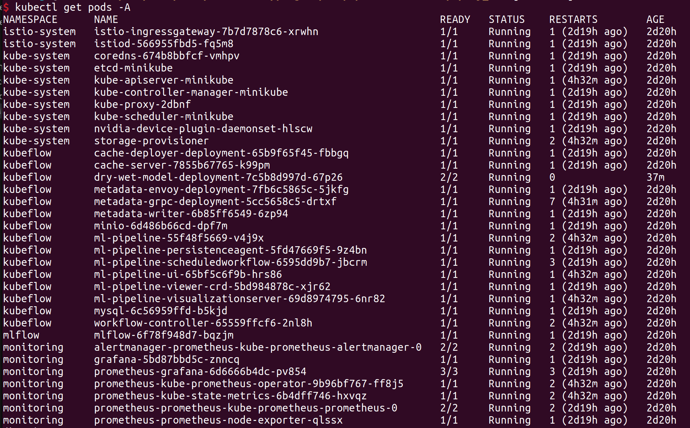
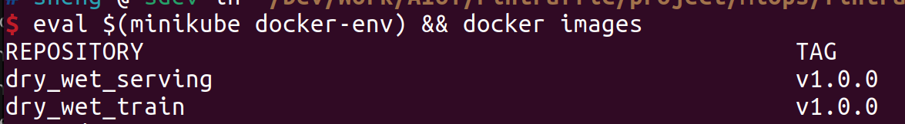
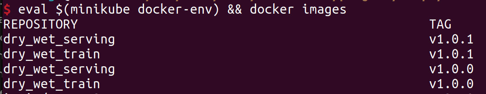
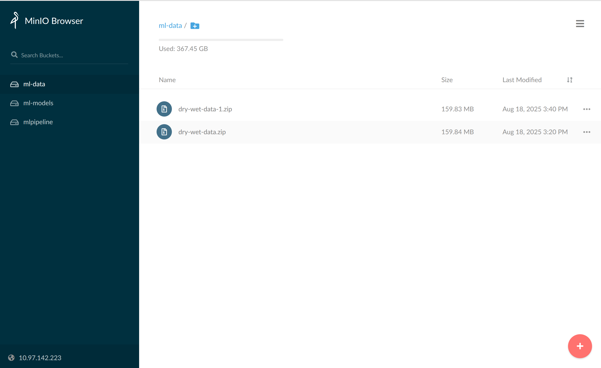
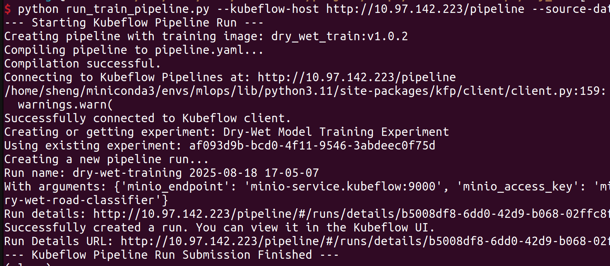
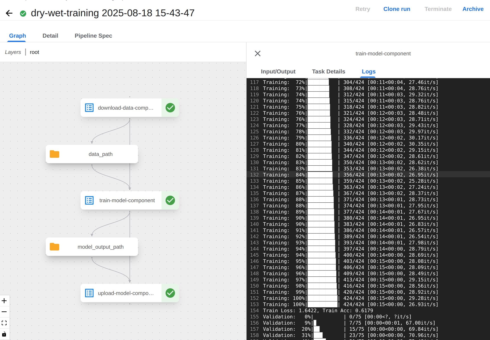
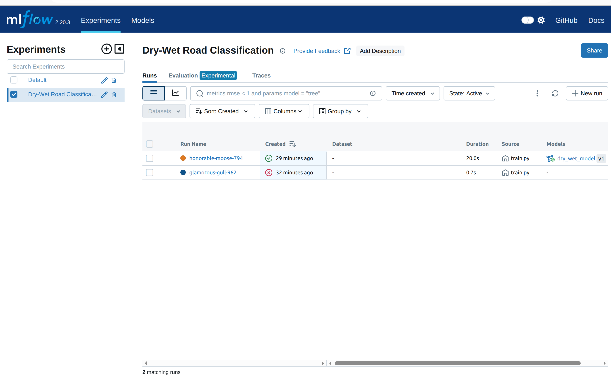
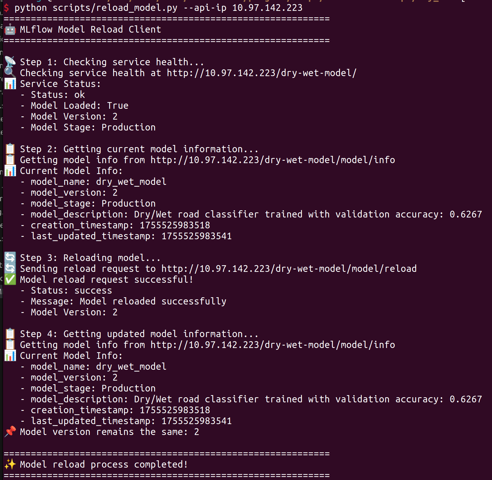
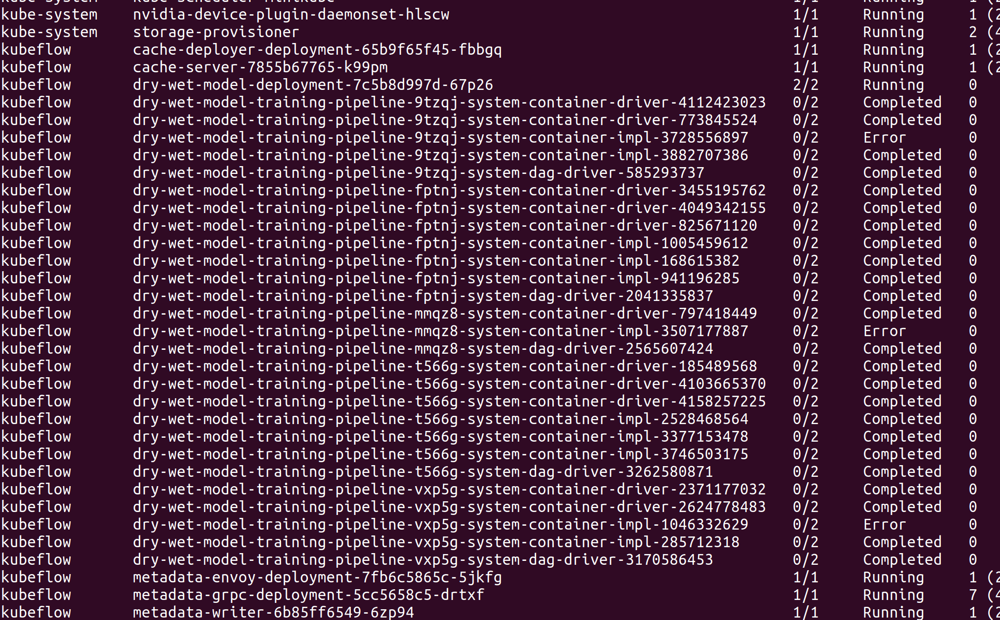
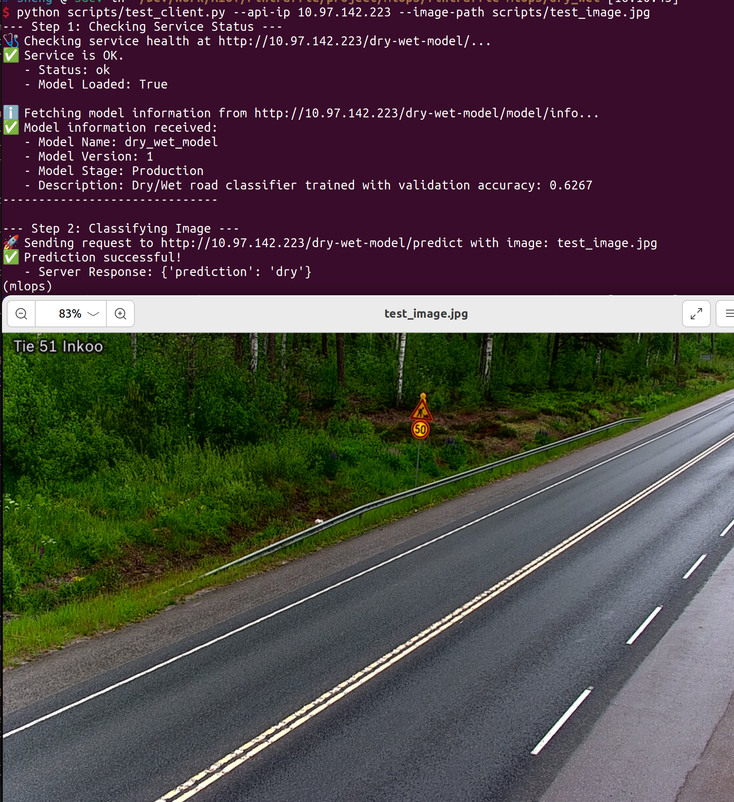

# Overview
This document is a step-by-step guide to setup the platform for the model training and inference.
The directory include two parts:
- `platform`: Scripts and resources for platform setup. This folder contains all the necessary files to set up the MLOps platform, including configurations for Istio, Kubeflow, MLflow, and other monitoring tools. It is designed to create a complete environment for model training, deployment, and monitoring.
- `dry_wet`: Model training and inference setup (creates two pods in Kubernetes)

In the future, we can add more models and services, such as a new folder called `snow_level`, and add the training and inference script and configuration there.


# 1. Prerequisites 

## Install Docker Engine
https://docs.docker.com/engine/install/  
Minikube needs to connect to docker without root privilege. After the installation, please follow *Manage Docker as a non-root user* part in this link: https://docs.docker.com/engine/install/linux-postinstall/

## Install minikube
https://minikube.sigs.k8s.io/docs/start/  
We only need the first step to install the minikube, but don't start the cluster now because we need more configuration.

## Install kubectl
https://kubernetes.io/docs/tasks/tools/install-kubectl-linux/  
This is the command line tool to interact with the cluster.

## Install helm
https://helm.sh/docs/intro/install/  
This is the package manager for the cluster.

## Setup the Nvidia support for minikube
Follow this link:
https://minikube.sigs.k8s.io/docs/tutorials/nvidia/

Use the instructions for docker, and use `NVIDIA Container Toolkit` method.
This is important if you want to use GPU for model training and inference.

# 2. Setup the cluster
Now that prerequisites are done, we can now create the cluster.
Adjust CPU and memory based on your system, this example uses 8 cores and 16GB memory.  
```
minikube start --driver=docker --container-runtime docker --gpus all --cpus 8 --memory 16384
```

## Configuration (optional)
Edit the provided config.yaml file to customize your setup.

## Start the tunnel for the cluster
It is recommended to start the tunnel before running the setup script, so that we can get the external IP for the cluster right after the setup is done. But it is not compulsory, you can always start the tunnel later and check the external IP manually.

To do this, open a new terminal and execute:
```
minikube tunnel
```
Keep this terminal running in the background.

## Run the setup script
Enter the directory `platform`, open the terminal and execute:
```
chmod +x setup.sh
```
```
./setup.sh
```
This will install the platform, including the kubeflow pipelines, mlops-gateway, and other services. During the setup, you can check the progress using `kubectl get pods -A` command, it will show the status of the pods.

This will take a while, so please be patient. If any step times out, you can try to run the script again. This script is idempotent, so you can run it multiple times if needed. You can also change the timeout value in the setup.sh file.

You can check the status of the pods by running `kubectl get pods -A` command.
The screenshot of the pods status:

All the pods should be in the `Running` state after the setup is done.

# 3. Setup the model

This section covers model training and inference. Once the platform is ready, you can add training and serving models as needed. We'll use a dry-wet road classification model as an example. 

## Project structure overview

The `dry_wet` folder contains two main components:

### Serving component (`serving/` folder)
The serving component runs a FastAPI-based HTTP service for model inference. Here's what it does:

- **FastAPI web service**: Runs on port 5001 and provides a REST API for model predictions
- **MLflow integration**: Automatically loads the latest model from MLflow Model Registry (Production stage)
- **Multiple API endpoints**:
  - `GET /`: Health check endpoint that shows service status and loaded model information, as well as the current serving image version.
  - `GET /model/info`: Detailed information about the currently loaded model
  - `POST /model/reload`: Reload the model from MLflow Model Registry (useful after training new models)
  - `POST /predict`: Main inference endpoint that accepts image uploads and returns 'dry' or 'wet' classification

- **GPU support**: Uses CUDA when available
- **Configuration**: Uses `config.yaml` to match training preprocessing settings

The deployment is managed by `serving/serving.yaml`, which defines three core Kubernetes resources:
1.  **Deployment**: Creates and manages the pods running the FastAPI application. The base deployment in the YAML file uses the `dry_wet_serving:v1.0.0` image. The `setup.sh` script handles building this image and triggering rolling updates with new versions.
2.  **Service**: Provides a stable internal network endpoint (`dry-wet-model-service`) for the application pods within the cluster.
3.  **VirtualService (Istio)**: Exposes the internal service to the outside world through the `mlops-gateway`. It configures the gateway to route external requests starting with the path `/dry-wet-model` to the internal service. For example, a public request to `http://<external-ip>/dry-wet-model/predict` is forwarded to the application's `/predict` endpoint.

### Training component (`training/` folder)
The training component handles model training with new data and registers models to MLflow. It 
includes:

- **Training pipeline**: Uses EfficientNet-B3 for binary classification (dry/wet roads)
- **GPU acceleration**: Since Nvidia support was configured in the prerequisites, the training process can utilize GPU 
acceleration for faster model training
- **MLflow integration**: Logs metrics, parameters, and model artifacts to MLflow for experiment tracking
- **Data management**: Downloads data from MinIO and handles preprocessing
- **Model registration**: Registers trained models to MLflow automatically
- **Configuration**: `config.yaml` contains the training hyperparameters, data augmentation settings, and 
model configuration


## Run the model setup script
The `setup.sh` script is used to setup the model for the first time. It will build the training and serving images and deploy the serving component.
If you later modify the code for either the training or serving components, check the following section to update the codes and components.

Enter the `dry_wet` directory and execute:
```bash
cd ../dry_wet
chmod +x setup.sh
./setup.sh
```

This `setup.sh` script performs the following tasks:
1. **Configure Docker environment**: Since we're using `docker` as the driver, the script configures Docker to use minikube's Docker daemon with `eval $(minikube docker-env)`. This way, images are built and stored locally without needing an external registry.

2. **Build baseline Docker images**: 
   - Builds the training image `dry_wet_train:v1.0.0`.
   - Builds the serving image `dry_wet_serving:v1.0.0`.

3. **Deploy the serving component**: Applies the `serving/serving.yaml` manifest to deploy all the necessary Kubernetes resources for the model serving pod.

After the setup is done. you can see the new images built, which are tagged with `v1.0.0`:


### Updating the Codes and Components

The initial `setup.sh` script is only for the first-time setup. When you modify the code for either the training or serving components, you should use the dedicated update scripts located in the `dry_wet/` directory.

It is a best practice to use unique, immutable tags for Docker images (e.g., `v1.0.1`, `v1.1.0`) instead of `:latest`. When you update your code, you should also assign a new version tag to your image. This is crucial for:
- **Traceability**: Knowing exactly which version of the code is running.
- **Reliable Deployments**: Kubernetes only triggers a deployment rollout if the image tag changes.
- **Avoiding Cache Issues**: Unique tags prevent build systems and Kubernetes from using stale, cached images.
- **Easy Rollbacks**: You can easily redeploy a previous, stable version if a bug is found.

The following sections will show you how to update the training and serving components.

#### Updating the Serving Component

If you have made changes to the `serving/` directory (e.g., modified `app.py`), run the `update_serving_component.sh` script with a new version number. This script will build a new image and trigger a rolling update of your deployment. You don't need to restart the serving component, it will be updated automatically using the new version.

```bash
cd dry_wet
chmod +x update_serving_component.sh
./update_serving_component.sh v1.0.1
```

#### Updating the Training Image

Similarly, if you've updated the training code in the `training/` directory, build a new training image using the `update_training_component.sh` script.

```bash
cd dry_wet
chmod +x update_training_component.sh
./update_training_component.sh v1.0.1
```

After building, you can use this new image in your training pipeline by specifying it in the `run_train_pipeline.py` script:

```bash
cd dry_wet
python run_train_pipeline.py --training-image "dry_wet_train:v1.0.1" ...
```

After updating the components, you can see the new images with new tag, for example `v1.0.1`:


> **Note**: If you choose to manually deploy using `kubectl apply -f dry_wet/serving/serving.yaml`, be aware that this will deploy the version specified in the file (by default, `v1.0.0`), not necessarily the latest one you have built.

## Upload training data

Before running the training pipeline, you need to upload your training data to MinIO.

### Automated data collection
In a production environment, data collection would typically be handled by a separate program that:
- Collects raw data from various sources
- Processes and cleans the data
- Performs human review and quality control
- Automatically uploads the processed data to the MinIO database

### Manual data upload
For testing and development purposes, you can manually upload data through the MinIO web interface:

1. **Access MinIO interface**: Open your browser and go to `<external-ip>/minio`
   - You can find the external IP by running `kubectl get svc -n istio-system` and check the External IP field.
   - Default credentials: username `minio`, password `minio123`

2. **Upload to ml-data bucket**: 
   - Enter the `ml-data` bucket
   - Upload your training data as a zip file (e.g., `dry-wet-data.zip`)
   - The zip should contain your training images organized in folders by class (e.g., `dry/` and `wet/` folders)

The screenshot of the MinIO interface:


## Running the training pipeline

Ideally, this training process would be automatically triggered by the data collection program after uploading new data. For testing and development purposes, you can manually execute the training.

To train a new model with updated data, use the `run_train_pipeline.py` script:

```bash
cd dry_wet
python run_train_pipeline.py
```

### Script Parameters

The `run_train_pipeline.py` script accepts various command-line arguments to customize the training pipeline:

#### Kubeflow Connection Parameters
- `--kubeflow-host`: The URL of the Kubeflow Pipelines API endpoint  
  Default: `http://localhost/pipeline` (Note, this must be changed to the Istio Ingress Gateway IP, which can get from `kubectl get svc -n istio-system`)
- `--training-image`: Docker image for training pipeline components  
  Default: `dry_wet_train:v1.0.0`

#### MinIO Connection Parameters  
- `--minio-endpoint`: MinIO server endpoint URL  
  Default: `minio-service.kubeflow:9000`
- `--minio-access-key`: MinIO access key  
  Default: `minio`
- `--minio-secret-key`: MinIO secret key  
  Default: `minio123`

#### Data Source Parameters
- `--source-data-bucket`: Name of the MinIO bucket containing the source data  
  Default: `ml-data`
- `--source-data-object`: Name of the source data zip file in the bucket  
  Default: `dry-wet-data.zip`

#### Model Output Parameters  
- `--destination-model-bucket`: Name of the MinIO bucket to store the trained model  
  Default: `ml-models`
- `--destination-model-name`: Name for the destination folder in MinIO for the model  
  Default: `dry-wet-road-classifier`

### Example: Training with new data

1. **Upload your new data to MinIO**:
   - Access MinIO web interface at `<external-ip>/minio` (get external IP with `kubectl get svc -n istio-system`)
   - Default credentials: username `minio`, password `minio123` 
   - Upload `dry-wet-data-2025-01.zip` to the default bucket `ml-data`

2.  **Run training with custom data and kubeflow endpoint**:

    Before running the script, ensure you have installed the required Python dependencies specified in `requirements.txt`. It is highly recommended to use a dedicated Conda environment to manage these packages.
 
    Replace <external-ip> with your actual external IP from minikube tunnel
 
   ```bash
   python run_train_pipeline.py \
   --kubeflow-host "http://<external-ip>/pipeline" \
   --source-data-object "dry-wet-data-2025-01.zip"
   ```

   Since minikube tunnel may assign different IPs, you need to specify the `--kubeflow-host` parameter with your actual external IP.

This script automates the training process by:
1. **Compiling the Kubeflow pipeline**: Converts the Python pipeline definition to YAML format
2. **Connecting to Kubeflow**: Establishes connection to the Kubeflow Pipelines API
3. **Creating experiment**: Sets up or reuses the 'Dry-Wet Model Training Experiment' 
4. **Executing pipeline**: Runs the complete training workflow which includes:
   - Downloading data from MinIO storage
   - Training the model with the specified configuration
   - Logging experiments and metrics to MLflow
   - Registering the new model to MLflow Model Registry
   - Uploading model artifacts back to MinIO

The screenshot of the pipeline submission:


### Monitor training progress

During training, you can monitor the process through web interfaces:

1. **Kubeflow Pipeline Dashboard**: Open `<external-ip>/pipeline` in your browser
   - View pipeline execution status and logs
   - Monitor each step of the training workflow
   - Check for any errors or issues during execution

   

2. **MLflow Tracking Interface**: Open `<external-ip>/mlflow` in your browser
   - Track experiment metrics and parameters
   - Compare different training runs
   - View model artifacts and performance metrics
   - Monitor training progress in real-time

   

After training completes, you can update the serving component with the new model using the reload endpoint or the `scripts/reload_model.py` script.

### Reload the Model in the Serving Component

After a new model is trained, it gets registered in the MLflow Model Registry. However, the serving component, which is already running, is **NOT** automatically aware of this new model. We need to instruct it to reload and use the latest version from the registry.

This process can be easily automated and called by other programs. A example script `scripts/reload_model.py` is provided to trigger the model reload. This script requires the IP address of the serving API as a parameter, the one you can get from the `kubectl get svc -n istio-system` command.

```bash
cd dry_wet
python scripts/reload_model.py --api-ip <external-ip>
```
Remember to replace `<external-ip>` with the actual external IP of your service.

The screenshot of the reload model:



### Clean up completed pipelines (optional)

After the training pipeline is completed, the pods will remain in the `Completed` or `Error` state. If you have many completed pipelines and no longer need to check their logs, you can clean them up to free up resources.



You can use the `clean_completed_training_pods.sh` script to remove all pods with names starting with `dry-wet-model-training` that are in the `Completed` or `Error` state.

```bash
cd dry_wet
chmod +x scripts/clean_completed_training_pods.sh
./scripts/clean_completed_training_pods.sh
```

## Testing the service

To test the serving component, use the provided test client. This script also requires the IP address of the serving API and the path to the test image.

```bash
cd dry_wet
python scripts/test_client.py --api-ip <external-ip> --image-path <image-path>
```

This sends a test image to the prediction endpoint and displays the classification result.

The screenshot of the test client:


# Notes
There are some changes from the original metro-mlops-demo on the platform setup scripts:
1. Updated kubeflow manifests to use the platform-agnostic version to avoid issues like proxy-agent pod crashes in non-GCP environments. 
See link: https://github.com/kubeflow/pipelines/issues/9546

2. Split the yaml files in resources into separate files for easier management.

# Future Work

This project currently uses a simplified setup for local development and testing, which differs from a full-scale production environment in key areas:

1.  **Kubernetes Cluster**: We use `Minikube`, a tool that runs a single-node Kubernetes cluster on a personal computer. This is excellent for development and learning but lacks the high availability, scalability, and fault tolerance of a production-grade cluster. Production clusters distribute workloads across multiple machines, ensuring service continuity even if some nodes fail.

2.  **Image Registry**: The setup uses the local Docker daemon provided by Minikube (`minikube docker-env`) to store images. This avoids the need for an external registry, simplifying local development. However, in a large-scale, multi-node production environment, a centralized private image registry is essential. A private registry ensures that all nodes in the cluster can reliably access and pull the required container images, which is critical for distributed deployments, version management, and CI/CD automation.